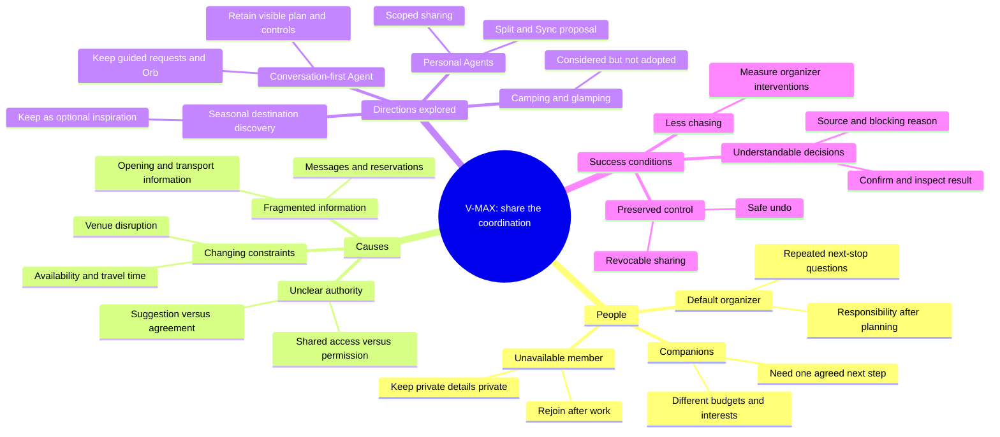
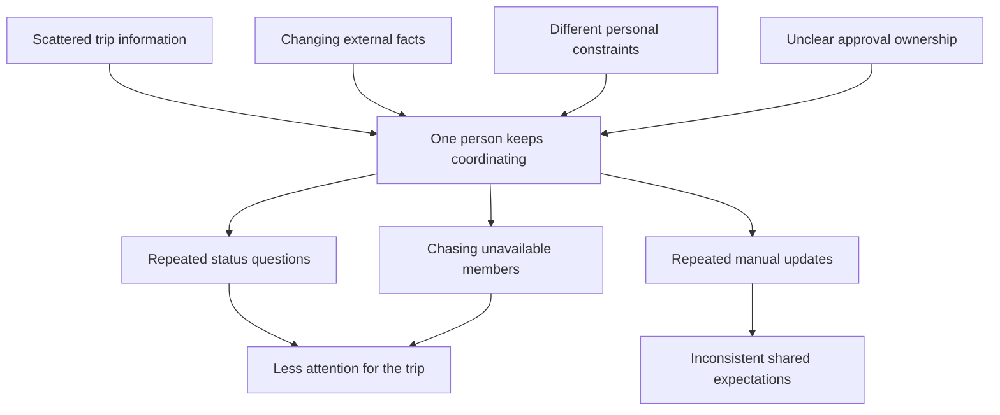
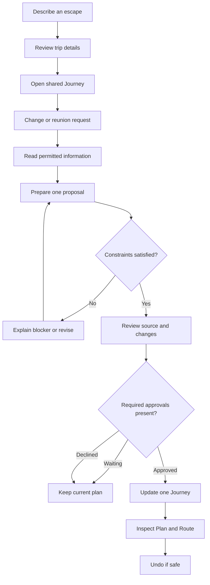

# V-MAX — Escape together. Without one person doing it all.

A mobile-first travel companion exploring **permissioned personal Agents, shared decisions and a journey everyone can inspect**.

> **Submission draft · 8 September 2026.** This is an interactive, local-state prototype, not a live AI travel service. Agent replies, disruption detection, other members and flight offers are simulated. The implemented approval, permission, itinerary and expense rules are real local application logic. Items marked **NEEDS TEAM INPUT** must be completed with genuine evidence before submission.

## Project and submission details

| Item | Details |
| --- | --- |
| Project | V-MAX / Hey V-MAX |
| Team | **NEEDS TEAM INPUT — official team name** |
| Members | **NEEDS TEAM INPUT — each member's name and contribution; do not publish unnecessary personal information** |
| Problem track | Lifestyle Track: Planning an Escape — Travel Planner |
| Public GitHub repository | **NEEDS TEAM INPUT — public repository URL** |
| Demo video | **NEEDS TEAM INPUT — unlisted YouTube URL, no longer than 5 minutes** |
| Public working prototype | **NEEDS TEAM INPUT — deployed URL; a localhost address is not accessible to judges** |
| Slides | **NEEDS TEAM INPUT — public slide link if used, or state “Not used”** |
| Submission deadline | 13 September 2026, 23:59; **NEEDS TEAM INPUT — confirm the organizer's timezone** |

The organizer collects the **public GitHub URL and unlisted YouTube URL**. Put the evidence judges need in this README or the video; do not depend on them finding an external board or private file. **Ideation is assessed through the README, not the video.** Supplementary links should have their essential evidence reproduced here.

**Reading guide:** [Problem and impact](#1-overview-problem-and-impact) · [Solution](#2-solution-and-distinctive-experience) · [Ideation](#3-ideation-and-iterations) · [Design](#4-design-and-user-experience) · [Implementation boundaries](#5-what-the-prototype-actually-does) · [Architecture](#6-architecture-and-feasibility) · [Run and evaluate](#7-run-and-evaluate) · [Submission checklist](#8-evidence-and-submission-checklist)

## 1. Overview: problem and impact

### The challenge is not only making the first itinerary

In the project owner's previous group trips, one person made the plan, then companions repeatedly asked that person about the next activity. Completing the itinerary had not removed their responsibility for keeping everyone informed.

That is the starting observation for V-MAX: **a group can have a plan and still depend on one person to keep it working**. When a venue's hours conflict with the itinerary, someone finishes work later, or a shared meal changes, the organizer has to gather information, check constraints, ask for agreement and communicate the result again.

This is one first-hand experience, not a completed user study. We do not yet claim how common the problem is or how much time V-MAX saves.

### Who we are designing for

Our proposed primary audience is **the default organizer in a small, self-organized group of 3–6 friends**, planning a multi-day leisure trip in which members have different budgets, interests or periods of availability. A mixed work/leisure afternoon is the focused demonstration, not a requirement for every user.

Their job to be done: *When the group separates or a plan changes, help us agree on what happens next without making me chase everyone or disclose their private information.*

| Stakeholder | Specific need | Current burden or risk |
| --- | --- | --- |
| Default organizer | An agreed next step and an up-to-date shared plan | Repeated questions, follow-ups and manual edits across tools |
| Companions exploring together | Know the next place, time and expected cost | Different interpretations of the plan or a missed update |
| Member temporarily unavailable | Rejoin without interrupting work or sharing their entire calendar | Delayed replies, pressure to disclose a precise location or accept an unsuitable time |
| Each individual member | Control what their representative may reveal or approve | Convenience can otherwise be mistaken for unrestricted consent |

**Underlying causes:** information is scattered; plans are time-dependent; shared access does not automatically produce agreement; and each person has constraints the organizer should not have to collect in full. The resulting problem is continuous coordination, not a lack of destination recommendations.

### Why existing options do not automatically resolve this specific problem

We are entering a capable market. **AI travel planning, shared itineraries and AI in group chat are not new on their own.**

| Existing option | Current capabilities from its official site | Remaining question that motivates our design |
| --- | --- | --- |
| Wanderlog | Collaborative editing and live syncing, AI assistance, reservations, route tools, budgeting and expense splitting. [Official feature descriptions](https://wanderlog.com/) | A shared itinerary is valuable, but how should the group establish whose constraints may be used, whose approval is missing, and when a proposed reunion is actually agreed? |
| Mindtrip | Personalized itineraries, real-time collaboration, group chat with `@Mindtrip`, receipt/confirmation organization and real-time airfare browsing. [Official product page](https://mindtrip.ai/) | A group AI assistant is already available. Our narrower design question is whether each member can delegate within explicit information and approval limits, with blockers and the final shared change made inspectable. |

Reviewed on 8 September 2026. The questions in the last column are **our design hypothesis**, not proof that a competitor lacks every comparable capability. These public pages do not establish the exact per-member permission and approval workflow we are testing. We have not completed a hands-on, head-to-head evaluation. Competitors already provide live integrations that this prototype does not.

### The intended before-and-after

The comparison below describes the intended workflow improvement; it is not a measured result.

| Situation | Organizer-led workflow | V-MAX prototype workflow |
| --- | --- | --- |
| A museum visit conflicts with opening information | Find the conflict, check another slot, ask the group, edit the itinerary and repeat the explanation | Open a sourced demo alert, review a proposed change, see required approvals, then apply one shared update |
| Three people explore while one is working | Ask where and when the fourth person is free, wait, estimate transfers and negotiate dinner | Ask the member's Agent for permitted information; review a reunion time against shared constraints; confirm or decline |
| Someone asks “What happens next?” | The organizer searches the plan or answers again | The same accepted itinerary drives Overview, Plan and Route |
| People consumed different portions | Reconstruct the bill and manually recalculate everyone's share | Review item amounts and portion weights, then save an exact, editable allocation |

**What would count as impact:** fewer organizer interventions, less time reaching an agreed change, fewer inconsistent plan answers, and no increase in unwanted disclosure or mistaken approvals.

For an initial evaluation, recruit 3–5 small groups and compare the same disruption/reunion task using their normal tools and the prototype; alternate which method is tried first. Record time to agreement, organizer follow-ups, task completion and whether each member can explain what was shared and approved. **This evaluation is proposed, not completed. NEEDS TEAM INPUT — participant details, consent, observations and actual results.**

### Potential scale, without an invented market-size claim

The initial scope is one destination and small groups. The coordination pattern may later transfer to family trips, friend trips and mixed work/leisure travel. Expansion depends on reliable local sources, transport estimates, language support and permission-aware collaboration—not simply adding more city photographs. We have not yet validated demand, willingness to pay or a total addressable market.

## 2. Solution and distinctive experience

V-MAX's core loop is **notice → coordinate within permissions → ask for the necessary decisions → update one shared Journey**.

| Feature | What the user experiences | Why it belongs in the core story |
| --- | --- | --- |
| Trip updates | A relevant problem, its source, the affected activity and a proposed alternative | An issue becomes a reviewable action, not another generic notification |
| Personal Agents in Group | Mention a specific member's Agent; it answers only from that member's shared fields | A person can remain unavailable without making their full calendar or precise work address public |
| Split & Sync | Separate daytime activities, followed by a reunion checked against availability, transfer allowance and meal budget | Different needs do not have to mean losing a shared evening |
| Shared decisions | Required approvals, waiting states and concrete blocking reasons appear before a plan is changed | A suggestion is visibly different from agreement |
| One Journey | Accepted changes propagate to Plan, Overview, Route and the group record; safe Undo is available | Users can inspect the result outside a conversation |
| Hey V-MAX workspace | Open action-oriented tools, compare illustrative flights or inspect coordination; typing is optional | The Agent is represented by work and reviewable outcomes, not only a chatbot transcript |

Trip wallet, preparation suggestions and itemized expense allocation support this journey. Discovery and seasonal saves remain optional inspiration; saving a destination does not insert it into an unrelated trip.

### Our originality claim

The proposed contribution is the **combination of permissioned personal representation, explicit shared approval and one inspectable itinerary state**. The standout demonstration is Split & Sync: Joshua's Agent can share permitted availability while refusing an unshared work address; a dinner proposal remains blocked when transfer time is insufficient; an agreed reunion then appears in the actual plan.

We do not claim to have invented AI assistants, agent-to-agent communication, group chat, itinerary generation, receipt splitting or glass interfaces. A second Agent is not a guarantee that another Agent is correct. Sources, deterministic checks, scoped consent and the user's final control are still necessary.

## 3. Ideation and iterations

**Evidence status:** the maps and iteration account below were reconstructed on 8 September 2026 from the project's recorded design conversation and implementation. They explain the reasoning, but they are **not original workshop boards, independent user research or proof of a mentor's exact words**. Add any genuine earlier sketches, dated screenshots and meeting notes alongside them.

### 3.1 Multilayer opportunity map — retrospective reconstruction



### 3.2 Problem tree — retrospective reconstruction



The tree separates causes from symptoms: adding a search box may help retrieve information, but it does not establish permission or group agreement. That distinction led us to make coordination and approval central.

### 3.3 Reasoned iterations, including directions not pursued

| Stage | Direction explored | What we learned or questioned | Decision and visible consequence |
| --- | --- | --- | --- |
| 1. Broad travel planner | Seasonal discovery, saves, setup, itinerary, group and budget | Recommendations alone did not explain how ongoing organizer work was reduced. An Iceland recommendation should not become a Tokyo activity. | Keep inspiration separate from trip-specific planning; validate destination context before adding activities. |
| 2. Narrower travel category | Camping and glamping | Considered after a mentor discussion, but the conversation did not establish commitment or validated demand for this segment. | Do not describe V-MAX as a camping product. Focus on a coordination problem before selecting a niche. |
| 3. Agent-first beginning | Splash, Orb greeting, spoken/typed requests and progressively collected details | A conversational beginning could reduce form-filling, but a text-first page could still look like an ordinary chatbot. | Keep the Orb and guided intent; show actions, comparisons and outcomes. Voice remains simulated. |
| 4. Combine the prototypes | Agent experience plus the earlier destination-led homepage | The project owner reported positive mentor feedback on the homepage. A restart risked discarding what worked. | Keep photography; shift the homepage's main emphasis from discovery to Trip updates, Next up and Trip wallet. |
| 5. Ongoing coordination | Closure scenario, personal Agents and Split & Sync | “The Agent handles it” leaves unanswered who consented, what was shared and whether the plan changed. | Add sharing limits, blockers, approvals, a group record, one updated Journey and guarded Undo. |
| 6. Clearer interface | Dense card dashboards, then a photographic Lens layout | Repeated cards and heavy translucent surfaces obscured primary actions. | Photos orient the user; glass supports navigation/actions; settings and details use progressive disclosure. |
| 7. Bound execution | Real flight purchasing, automatic taxis and continuous monitoring | These require live data, identity, provider access and transaction safeguards the prototype lacks. | Demonstrate comparison with fictional offers; save only an explicitly unbooked wallet note. Do not present a simulated purchase as real. |

**NEEDS TEAM INPUT — attach dated old/new artifacts for at least three substantive iterations and identify who made each decision.** Historical screenshots should use their actual stage; do not create fake “original” research artifacts after the fact.

### 3.4 Alternatives compared

| Alternative | Strength | Trade-off for our target problem | Selection |
| --- | --- | --- | --- |
| Shared itinerary and chat | Familiar, visible and editable | The organizer may still need to gather constraints and resolve agreement | Retain as the inspectable foundation |
| One general travel chatbot | Flexible requests and a low learning barrier | Conversation alone does not clarify approval, state or disclosure boundaries | Keep optional input, not as the whole product |
| Fully autonomous travel agent | Potentially minimizes interaction | Stale information can trigger costly actions; group consent is not automatic | Defer booking and payment autonomy |
| Personal representatives plus a shared coordinator | Makes individual limits and collective decisions explicit | Requires careful identity, permission and conflict handling | Chosen interaction model; production requirements remain work to do |

### 3.5 Mentor feedback and integration

Do not infer a mentor's name from a meeting filename or attribute the team's own ideas to the mentor.

| Evidence available now | Team interpretation and response | Evidence needed for submission |
| --- | --- | --- |
| The project owner reported that a mentor rated the earlier homepage highly | Preserve the destination-led visual entry and combine it with the Agent concept | **NEEDS TEAM INPUT — name/role, exact meeting date, specific feedback and a permitted note/excerpt** |
| After the mentor discussion, the team questioned whether the broad concept was innovative enough and reconsidered target users | Explore camping/glamping, then pause that direction and investigate continuing organizer burden | **NEEDS TEAM INPUT — distinguish actual mentor advice from the team's subsequent interpretation** |
| The recorded project conversation developed personal Agents, proactive changes and Split & Sync | Turn the concept into sharing settings, blocked proposals, approval states and shared-state updates | Presently **team-led iteration evidence**, not a verified mentor quotation |

**Complete before submission:** add a specific feedback → decision → artifact → outcome account for each meaningful mentor intervention. Include advice not followed and why. Without the missing evidence, this section does not establish the rubric's full mentor-integration standard.

### 3.6 Chosen user flow — retrospective reconstruction



The prototype supplies fixed scenarios and local rule-based Agents for this flow. It does not discover an issue online or contact other people. An existing, explicitly delegated reunion permission can satisfy a member's approval only within the modeled limits; it is not blanket authority.

## 4. Design and user experience

### Design intent

The interface combines destination photography with restrained glass navigation, neutral dark reading surfaces and a consistent action hierarchy. The aim is a calm travel companion—not a dashboard of equally urgent cards and not a chat window hiding the plan.

- **Home:** Trip updates → Next up → Trip wallet, ordered around the current journey.
- **Journey:** Overview, Plan, Route, Group and Budget preserve direct information access and manual control.
- **Hey V-MAX:** an Orb identity leads to tools and reviewable outcomes; `Type instead` remains available.
- **Confirmation:** proposals distinguish “my approval,” “waiting for others,” “blocked” and “applied.” Text supports color, rather than relying on color alone.
- **Profile:** practical personal details and revocable Agent permissions; settings disclose what they affect.
- **Motion:** bounded photograph movement and a sliding glass lens; reduced-motion and reduced-transparency fallbacks. This is a web interpretation, not native Apple Liquid Glass.

### Prototype and screen evidence

**Public prototype: NEEDS TEAM INPUT — insert the tested public URL here.**

Embed 4–8 current screenshots directly below before submission. These seven planned captions describe what each screenshot should prove; **the table is not a substitute for actual images**. Avoid showing real email addresses, booking codes or private chat content.

| Screen to embed | Caption / what the judge should notice | Asset status |
| --- | --- | --- |
| Home | Relevant trip information has priority: an actionable update, the next step and the wallet | **NEEDS TEAM INPUT — screenshot** |
| Hey V-MAX flight comparison | Journey context and baggage-aware illustrative totals lead to explicit, unbooked shortlist confirmation | **NEEDS TEAM INPUT — screenshot** |
| Journey Overview / Plan | The destination, next activity and accepted plan remain visible outside the conversation | **NEEDS TEAM INPUT — screenshot** |
| Shared decision | A blocker or missing approval is visible before the itinerary can change | **NEEDS TEAM INPUT — screenshot** |
| Group with a personal Agent mention | Shared information supports coordination while unshared details remain unavailable | **NEEDS TEAM INPUT — screenshot** |
| Profile permissions | The member chooses availability, broad-area and meal-budget sharing, plus bounded reunion delegation | **NEEDS TEAM INPUT — screenshot** |
| Budget receipt allocation | Editable portions produce an exact total and inspectable per-person result | **NEEDS TEAM INPUT — screenshot** |

Apple-style clarity, the earlier homepage, travel imagery and Lusion-like restrained responsiveness informed the visual direction. These are design references, not affiliations, imported product code or evidence of originality by themselves.

## 5. What the prototype actually does

| Area | Implemented locally | Simulated, absent or not guaranteed |
| --- | --- | --- |
| Planning | Destination-aware journey creation, date/traveler/budget validation, activity placement and editing | No general-purpose AI itinerary model or live venue inventory |
| Agent coordination | Mention routing, permitted-field replies, availability/transfer/budget checks, approvals and proposal application | Deterministic example replies; no separate running Agents, A2A network or real messages to members |
| Trip updates | Reviewable closure scenario and source link; accepted changes modify the local itinerary | Closure discovery and demonstration clock are fixtures, not monitoring or a live alert |
| Hey V-MAX | Action workspace for flights, coordination and journey tools; optional typed intent routing | No model reasoning, working wake word, realtime microphone, image understanding or voice call |
| Flight comparison | Fictional carrier-neutral KUL → Tokyo round-trip options, baggage/direct filters, per-person and group totals, confirmed wallet shortlist | Not live prices, available seats, provider-verified taxes, a ticket or purchase; no expense is created |
| Profile | Local display name, email-shaped sample and departure preference; local demo sign-in/out | No authentication, verification email, password, real account or cloud session; use sample data |
| Journey state | Plan, next stop, decisions, documents and expenses share data; changes survive a normal refresh | No cross-device sync, concurrent-user conflict handling or server-enforced access control |
| Route and arrival | Static map/photo guidance, manual arrival state and external transport links | No GPS detection, indoor positioning, live navigation or automatic taxi order |
| Budget | Editable receipt items and weighted portions, exact-cent allocation, repeat-safe receipt resaving | No camera OCR, bank connection, payment or currency conversion service |
| Wallet / preparation | Sample document entries, an explicitly unbooked flight note and rule-derived preparation suggestions | A saved note is not a verified booking, offline ticket download or airline boarding pass |

**Security boundary:** all sample members and their data exist in the same browser. Sharing controls demonstrate intended behavior; they are not secure isolation between real people. Do not enter sensitive travel documents or real private information.

## 6. Architecture and feasibility

### Current architecture, verified against source

The browser renders a React application. Hash navigation selects the page and trip context; `useTravelStore` holds shared state. Components call deterministic domain functions, then update that state. The store writes it to browser `localStorage`. There is **no application server, remote database or connected AI/booking API** in this repository.

| Layer | Current choice and source | Rationale / constraint |
| --- | --- | --- |
| Frontend | React + TypeScript + Vite; [package.json](package.json), [App.tsx](src/App.tsx) | Rapid, typed iteration on mobile-first flows; static delivery. Not a native mobile app. |
| Interface | CSS, local visual assets, `simple-liquid-glass` pinned to 4.1.0 | Small glass enhancement with fallback styling. Refraction varies by browser; core controls must work without it. |
| State / persistence | [useTravelStore.ts](src/state/useTravelStore.ts), [Trip types](src/types/trips.ts) | One source for journey views; validated recovery/migration. Corrupt stored data is not silently overwritten. Browser storage is not a database or security boundary. |
| Proposal rules | [agents.ts](src/domain/agents.ts) | Permission, approval, scheduling and Undo checks are inspectable and testable. Transfer assumptions are demo rules, not map estimates. |
| Replies / task routing | [group.ts](src/domain/group.ts), [assistant.ts](src/domain/assistant.ts) | Explicit bounded behavior avoids implying a general Agent is connected. Unsupported requests can remain unsupported. |
| Cost allocation | [receipt.ts](src/domain/receipt.ts) | Integer-cent arithmetic and remainder allocation keep portions consistent; no LLM calculates the final sums. |
| Profile | [profile.ts](src/domain/profile.ts) | Normalized local details and demo-session state; stable member IDs preserve approvals and expenses. |
| Backend / database | None | Test the interaction and local state contract before adding identity and concurrency. |
| APIs / integrations | None for live intelligence, flight inventory, maps or payments | Official-source and transport links are links, not API integrations. Images/maps are reference assets. |
| Hosting | Vite produces static `dist/`; Cloudflare Pages is proposed below, not deployed | Public working URL **NEEDS TEAM INPUT**. Public GitHub source alone is not a hosted app. |

### What a production pilot needs first

1. **Identity and permissions:** real authentication, verified trip membership, server-enforced field access, secure document storage, revocation and deletion. Never send a full private calendar to a group Agent and rely only on a prompt to hide it.
2. **One authoritative journey:** versioned trip updates, proposal/approval records and transactional, idempotent application. Concurrent edits must force a re-check rather than overwrite another member's changes.
3. **Evidence before recommendations:** a narrowly scoped source adapter with timestamps, stale-data behavior and source links. An LLM may interpret an update; deterministic constraints and explicit authority govern an action.
4. **Limited assistance, then transactions:** add user-reviewed receipt extraction and opt-in voice after shared decisions work. Live fares require supplier access and re-pricing. Any later purchase requires final confirmation of provider, itinerary, total price and payment—not a general “Agent can help” toggle.

### Proposed pilot stack — selected direction, not provisioned

Use **Cloudflare Pages + Supabase** for the first shared pilot. This preserves the current frontend and gives a small team one managed backend rather than several independent Agent services.

| Component | Proposed responsibility and safeguard |
| --- | --- |
| Cloudflare Pages Free | Serve the existing Vite `dist/` as static files; no Pages Functions are needed. This keeps frontend delivery separate from backend secrets. [Static-request pricing](https://developers.cloudflare.com/pages/functions/pricing/) |
| Supabase Auth | Google OAuth for invited pilot users, with identity/profile scopes only—not calendar access. Client registration, consent configuration and redirects must be set up before testing. [Google sign-in documentation](https://supabase.com/docs/guides/auth/social-login/auth-google) |
| Supabase Postgres + RLS | Store trip membership, proposals, approvals and expenses. Separate owner-only private details from explicitly shared fields; deny access by default and test each role. Never expose an administrative secret in the browser. [RLS documentation](https://supabase.com/docs/guides/database/postgres/row-level-security) |
| Supabase Realtime | Deliver authorized shared changes so each member sees the committed Journey; subscribe only to shareable records, not private calendar data. [Postgres Changes documentation](https://supabase.com/docs/guides/realtime/postgres-changes) |
| TypeScript Edge Functions + database RPC | Validate the request and prepare a proposal in an Edge Function. Commit through one restricted Postgres function that rechecks identity, trip version, permissions, constraints and approvals, then writes the plan and audit record atomically. Repeated request IDs must not repeat an action. [Edge Functions](https://supabase.com/docs/guides/functions), [database functions and privileges](https://supabase.com/docs/guides/database/functions) |
| Supabase Cron | Schedule short, bounded source-check jobs for active trips; deduplicate unchanged information before notifying. This is not a continuously running Agent. [Cron documentation](https://supabase.com/docs/guides/cron) |

Personal Agents would initially be **logical per-member roles inside one orchestrator**, each receiving only permitted context. An interoperable A2A network is unnecessary for this pilot. The transaction and disclosure rules stay deterministic regardless of the later model choice. No Supabase project, OAuth client or Cloudflare deployment has been created by this documentation work.

### Phased build scope

These are **planning estimates**, not a claim that staffing is committed or the work is finished. Confirm against the actual team and build-phase duration.

| Phase | Bounded output | Exit condition | Indicative effort |
| --- | --- | --- | --- |
| Submission prototype | One Tokyo/Fuji story; local coordination, approval, wallet and budget; README/video evidence | Rehearsed end-to-end demo, honest labels, completed evidence | Current phase, before 13 September |
| Secure shared pilot | One city, 3–6 members per group, authenticated membership, versioned state and server permissions | Two accounts cannot read unshared fields or overwrite a stale proposal | 3–4 weeks |
| Evidence-backed coordination | One venue source, a narrow reunion workflow, opt-in notifications and stale-source handling | Sources, permissions and constraints checked before a proposed change | 3–4 weeks |
| Evaluate and harden | Small-group task tests, accessibility, recovery and cost measurement | Users understand approvals; benefit and failure cases are documented | 2 weeks |
| Later, not required for pilot | Voice, reviewed OCR, broader sources and supplier flight search | Separate privacy, access and operational checks | Re-estimate after the pilot |

The 8–10 week pilot estimate assumes two development contributors and a part-time design/testing contributor; **NEEDS TEAM INPUT — confirm actual capacity or revise the estimate**. Automatic purchasing, autonomous taxi dispatch, global coverage, indoor navigation and a fully interoperable multi-Agent network are outside this pilot.

### Resources, cost and operational limits

Official limits checked **8 September 2026**; amounts are **USD**, not MYR. These are proposed service costs, not active subscriptions or a promise of free production operation.

| Service / stage | Published cost and relevant allowance | Pilot implication |
| --- | --- | --- |
| Cloudflare Pages Free, static frontend | Static requests are free; Free allows 500 builds/month, one concurrent build, 20,000 files and 25 MiB per asset. [Pricing](https://developers.cloudflare.com/pages/functions/pricing/), [limits](https://developers.cloudflare.com/pages/platform/limits/) | Proposed US$0 frontend hosting within terms/limits. Paid Functions, other services and a purchased domain are not included. |
| Supabase Free, development | US$0/month: 500 MB database, 1 GB files, 5 GB egress, 50,000 MAU, 500,000 Edge invocations, 2 million Realtime messages and 200 peak connections. Two active projects maximum; inactivity pause after one week; no automatic backups. [Official pricing](https://supabase.com/pricing) | Suitable for controlled development, not a reliability promise for a live trip. |
| Supabase Pro, active shared pilot | From US$25/month; US$10 compute credit covers one Micro project. Includes 8 GB database, 100,000 MAU, 250 GB egress, 2 million Edge invocations, 5 million Realtime messages/500 peak connections and seven-day daily backups; no inactivity pause. [Official pricing](https://supabase.com/pricing) | Proposed base infrastructure from US$25/month plus tax, excluding extra projects/compute, add-ons and overages. Budget approval still required. |
| Model, voice, OCR and travel inventory | No selected provider, confirmed commercial access or price | Excluded from the base subtotal and not silently treated as free. Voice/OCR and booking integrations remain later phases. |

Sizing assumption: **20 trips × 14 active days × 2 scheduled checks = 560 check jobs**, plus explicit user actions. At four members per trip this is at most 80 distinct pilot members, not a demonstrated capacity result. Cache unchanged venue data; measure database size, egress and message fan-out, not just user count. Keep jobs short: Edge Functions have a 2-second CPU limit per request and finite worker duration. [Runtime limits](https://supabase.com/docs/guides/functions/limits)

Set application-level quotas and usage alerts before the pilot; require approval before adding paid services or expanding capacity. **NEEDS TEAM INPUT — account/budget owner, confirmed staffing, deployment URL, data region/retention decision and measured cost per active trip.** Model and supplier pricing must be assessed separately before those integrations are enabled.

## 7. Run and evaluate

### Local setup

Use a Node.js version supported by the locked Vite package: `^20.19.0` or `>=22.12.0`. Install from the committed lockfile:

```bash
cd vmax-app
npm ci
npm run dev
```

If this directory is the repository root, omit `cd vmax-app`. Open the local address printed by Vite. No API key, account or `.env` secret is needed. Use fake details such as `alex@example.com` for the local profile preview.

```bash
npm test
npm run build
npm run preview
```

The manifest uses `latest` for several dependencies; retain `package-lock.json` and use `npm ci` for the reviewed dependency set. Output is `dist/`. Re-test the actual public host, asset paths and mobile layout after deployment.

### A focused demonstration, under five minutes

Target **4:40**, leaving margin for the five-minute limit. Keep detailed ideation evidence in Section 3 of this README.

| Time | Show | Point to make |
| --- | --- | --- |
| 0:00–0:30 | Repeated-next-stop experience and target group | A plan exists, but one person still carries coordination |
| 0:30–1:00 | Home and Hey V-MAX's action workspace | Journey-aware, inspectable work—not only conversation |
| 1:00–1:55 | Closure demo: source, proposed move, personal approval, explicitly simulated member approvals, updated Plan | An Agent's suggestion is not automatically applied |
| 1:55–3:25 | Day 2: mention a personal Agent; show a sharing boundary, blocked 18:30 and workable 19:00 reunion; confirm and inspect Plan/Route | Different afternoons become an agreed shared evening without unrestricted disclosure |
| 3:25–3:55 | Receipt portions and exact result | Practical consequences remain visible and editable |
| 3:55–4:25 | Architecture and demo/live boundary | Local rules work; identity, real sources and sync are next |
| 4:25–4:40 | Actual findings, or proposed evaluation if not yet run | Return to organizer burden without invented impact statistics |

Rehearse the exact local data state. The **Demo** chapter switch changes the sample clock, not members' real locations. Use a proposal's Undo where safe; do not clear existing user storage to reset a demonstration. See [REVIEW-GUIDE.md](REVIEW-GUIDE.md) for step-by-step checks.

### Validation evidence and its limits

**Validation recorded on 8 September 2026: 78/78 regression tests passed and the production build passed.** Coverage includes destination isolation, date/budget rules, participant-aware schedules, stale-proposal protection, repeat-safe updates, guarded Undo, permission revocation, targeted mentions, exact receipt allocation, local Profile behavior and sample flight comparison. Re-run the final submission commit after any subsequent changes.

Browser checks at 320px and 390px included local Profile entry and refresh, a confirmed comparison surviving in Trip wallet, and the group flow blocking 18:30 then accepting a valid 19:00 reunion. These are implementation checks, not target-user research or a claim that every browser/device has been tested.

Useful acceptance checks:

- An Iceland recommendation cannot be added as an activity to a Tokyo journey.
- An unshared budget or detailed work location is not returned by the member's local Agent.
- One person's approval does not impersonate the other members' agreement.
- An infeasible reunion explains the blocker and does not change the plan.
- Simultaneous activities for different participants do not become false scheduling conflicts; rest adjustments preserve the participants of the affected schedule.
- A stale museum proposal cannot overwrite a visit that was completed, renamed, repriced or reassigned. Someone outside its participants cannot approve it.
- Accepted changes appear in the saved itinerary and next-stop views; repeat confirmation does not duplicate a stop.
- Undo refuses to overwrite a subsequently edited or removed confirmed stop.
- Undo also pauses if returning a moved stop to its previous time would conflict with a newly added activity.
- Pizza MYR 64 with weights `1:2:1:0`, plus water MYR 4 with weights `1:0:1:0`, produces `18, 32, 18, 0`; saving again does not double-charge.
- A flight shortlist remains sample/unbooked and changes neither existing tickets nor expenses.
- An unbooked shortlist does not increase missing-ticket or preparation-document counts.
- Profile demo sign-out preserves journeys and does not imply a real authenticated account existed.
- Small-screen, keyboard and reduced-motion use preserve access to primary actions.

Implementation tests are not usability research, live integration tests or proof of secure multi-user operation. **NEEDS TEAM INPUT — final commit, test/build results, device/browser checks and actual user-test findings.**

## 8. Evidence and submission checklist

| Judging area / component weights | Evidence provided here | What still needs genuine completion |
| --- | --- | --- |
| Impact · 20%: causes/stakeholders 5, target 5, before/after 7, scale 3 | Specific audience, problem causes, concrete workflow and cautious expansion rationale | Interviews and comparable task results; no invented savings percentage |
| Ideation · 25% — README only: mapping 8, reasoned iterations 7, mentor integration 7, alternatives 3 | Multilayer map, problem tree, flow, kept/dropped directions and alternatives | Original dated artifacts; verified mentor identity/date/feedback and resulting change |
| Creativity · 15%: original combination 7, standout feature 5, differentiation 3 | Personal representation + Split & Sync + shared approval; current competitors | Demonstrate the combination; avoid unsupported first-to-market claims |
| Feasibility · 15%: stack 6, scope 5, resources/cost/time 4 | Current architecture, concrete proposed pilot stack, official cost allowances and bounded phases | Budget/account ownership, actual capacity, measured usage and public deployment |
| Design · 10%: consistency 4, usability 4, end-to-end 2 | Consistent hierarchy, progressive disclosure and inspectable decision states | Embed 4–8 screenshots and report usability findings |
| Presentation · 15%: clarity 5, flow 4, delivery 4, persuasion 2 | Focused story, visible outcome, boundaries and sub-five-minute run sheet | Clear voiced recording, readable capture, rehearsed delivery and unlisted link |

This is an evidence checklist, not a predicted score or a claim of full marks.

Before submitting:

- [ ] Replace every **NEEDS TEAM INPUT** with accurate information, or explicitly state evidence is unavailable.
- [ ] Keep essential ideation and mentor evidence in this README; a video or private board is not a substitute.
- [ ] Embed 4–8 current screenshots and genuine iteration artifacts with useful captions.
- [ ] Audit photos, maps, screenshots, logos, fonts and other assets for permission to include in a **public repository**. Record provenance/license/attribution; “found online” or “in public/” is not a license. Replace material without confirmed rights.
- [ ] Credit `simple-liquid-glass` and dependencies according to their licenses; do not imply Apple or Lusion affiliation.
- [ ] Remove real personal data, private documents, secrets and local-only links from submission assets.
- [ ] Test lockfile installation, production build, public deployment and the final demo sequence.
- [ ] Verify public GitHub README/images/diagrams when signed out; verify unlisted YouTube access, audio and duration.
- [ ] Confirm the organizer's timezone; submit the two required URLs before 13 September 2026, 23:59.

The outcome we want to test is simple: **everyone can enjoy the escape without one person having to hold the whole trip together.**
