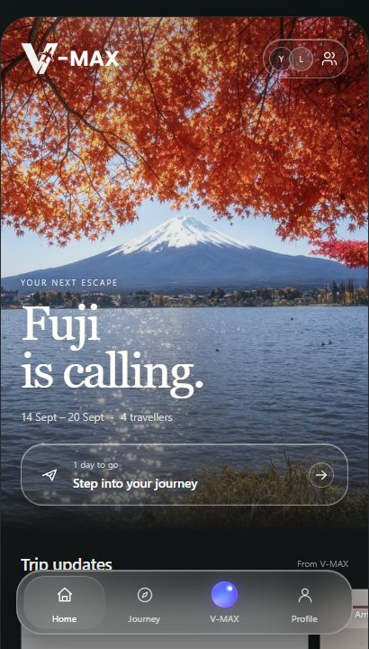
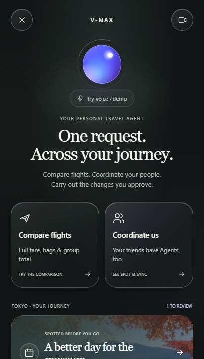
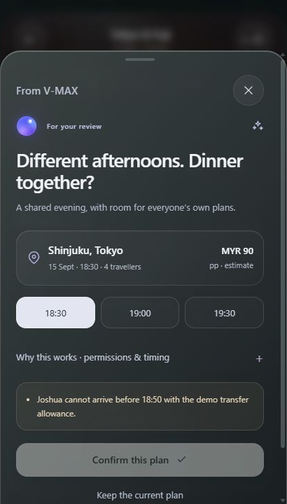
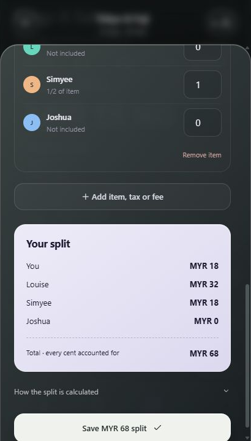
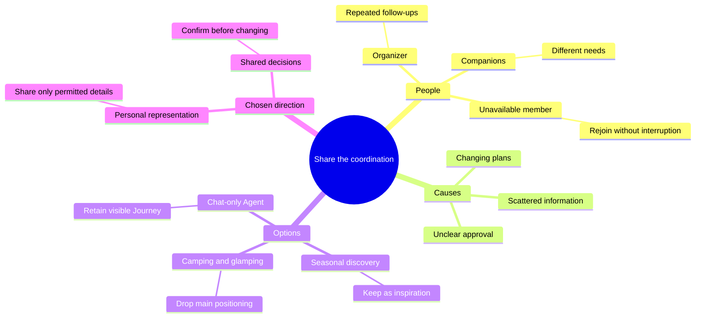
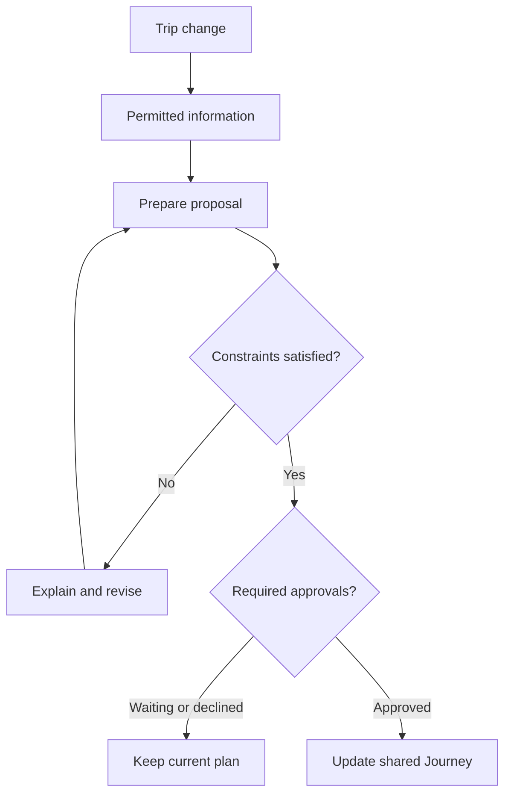

<div align="center">

# V-MAX

### Escape together. Without one person doing it all.

Your friend is in a meeting. Plans have changed. **Why is it still your job to chase everyone?**

Personal travel Agents. Shared decisions. **Your final say.**

**[Try the live prototype ↗](https://vmax-one.vercel.app/)** · [Pick a demo moment](#three-moments-to-try) · [How we got here](#2-ideation--process) · [Build plan](#5-technical-architecture--feasibility)

Lifestyle Track: Planning an Escape · Travel Planner · Team V-MAX

</div>

| Your escape, at a glance | One request. Across your journey. |
| :---: | :---: |
| [](https://vmax-one.vercel.app/) | [](https://vmax-one.vercel.app/) |
| A destination-led home with the next action close by. | Start a task, not an empty chat. Typing is still available. |

**A working website, not a live Agent service.** The prototype runs without sign-in. Decisions, permissions, itinerary updates and calculations work in your browser; Agent replies and travel data are simulated. Use sample information only.

## 1. Project Overview

### The plan is shared. The responsibility isn't.

In Louise's family and friend trips, one person planned, shared the details, then kept answering questions. Last-minute objections and disruptions brought everyone back to that organizer — sometimes causing conflict.

**For:** the default organizer and their companions in small family or friend groups. **Goal:** less chasing, clearer next steps, and an organizer who enjoys the escape too.

Tools such as [Wanderlog](https://wanderlog.com/) and [Mindtrip](https://mindtrip.ai/) already support collaborative planning. Our experience suggests the organizer may still have to chase agreement. V-MAX asks: **who represents an unavailable member, and when is a change agreed?** This is a design hypothesis, not a claim that competitors lack similar capabilities.

Our solution connects each member's personal Agent to shared decisions and an editable Journey.

### Three moments to try

**01 · Try to arrange dinner too early.**

Open **V-MAX → Coordinate us → Review shared decision**; continue past the introduction if shown. **18:30** is blocked: Joshua's modeled arrival is **18:50**. Choose **19:00**, review approvals, confirm, then check **Plan → 15 Sept**.

*Different afternoons become one feasible reunion, visible in the plan.*

**02 · Ask an Agent something it shouldn't share.**

In **Journey → Group**, type `@` and choose Joshua's Agent. Ask about availability, then an exact work address. Compare the permitted answer with the privacy boundary. Your own controls are in **Profile**.

*Representation without unrestricted access. All sample members share one browser: these controls demonstrate intended permissions, not secure isolation between real users.*

**03 · Catch the closure before reaching the door.**

Open **Home → Trip updates → “Closed Monday. We caught it early.”** Review the source, replacement day and required approvals before applying the change.

*Evidence → alternative → agreement → updated Journey. A fixed scenario, not live monitoring.*

| “18:30 doesn't work.” | “I only had a quarter.” |
| :---: | :---: |
|  |  |
| A blocked decision explains the conflict before anything changes. | Bonus: **Journey → Budget → Split a receipt**. Change who had what; totals recalculate. |

<details>
<summary>What's real in these demos?</summary>

| Works locally today | Simulated or not connected |
| --- | --- |
| Constraint checks, sharing rules, approval states and Journey updates | Personal Agents, other members and proactive disruption detection |
| Editable receipt items, portion-based splitting and group balances | Camera/OCR extraction and money transfers |
| Sample flight comparison, baggage-inclusive totals and wallet shortlist | Live fares, reservations and purchases; the shortlist is explicitly **unbooked** |
| Local profile, preferences and saved browser state | Verified sign-in, cross-device sync, GPS and realtime voice |

In the sample receipt, MYR64 pizza is divided **1 : 2 : 1 : 0**; MYR4 water is shared by You and Simyee. The result is **18 + 32 + 18 + 0 = MYR68**. Reviewable arithmetic, not an AI guess. Saving is a separate action.

</details>

**Impact evidence:** Louise reports feedback from at least three people plus a mentor; task outcomes are undocumented. Next: compare organizer follow-ups, time to agreement and approval understanding with their usual tools. No measured time-saving claim yet.

**Beyond the pilot:** the coordination pattern could extend to other destinations; each expansion needs verified local sources and operational testing.

## 2. Ideation & Process

### From “more travel features” to “less coordination work”

| Direction explored | Decision and reason |
| --- | --- |
| **Personal Agents + Split & Sync** | **Chosen:** represent shared needs, then review a reunion |
| **Agent opening + editable Home/Journey** | **Combined:** keep assistance and manual control |
| Broad, feature-first planner | **Reframed:** useful features already exist; focus on ongoing follow-up |
| Seasonal destination discovery | **Secondary:** inspiration alone doesn't solve coordination |
| Accessibility and dietary niche | **Broadened:** disability access, Muslim and vegetarian needs remain product-wide considerations |
| Camping & glamping | **Dropped:** CJ's focused-category idea; broader coordination became our priority. The perceived market gap was unvalidated |
| Chat-only interface | **Dropped:** hard to see what actually changed; risk of appearing to be a generic chatbot |
| Autonomous booking / taxi ordering | **Deferred:** live data, identity, payment safeguards and explicit transaction approval come first |

| Iteration | Problem → change → lesson |
| --- | --- |
| Feature-first planner | Too many familiar features → prioritize coordination → a clear problem matters more than feature count |
| Agent-first opening | Conversation hid outcomes → restore Home/Journey → users need to inspect and edit the plan |
| Combined experience | An answer wasn't an agreement → expose approvals and resulting updates → make the handoff visible |

### Ideation boards

Reconstructed from our design conversation on **8 September 2026**. These are retrospective summaries; original sketches are still to be attached.

<details>
<summary>Open the idea map — people, causes and alternatives</summary>



</details>

<details>
<summary>Open the chosen decision flow — a suggestion isn't an agreement</summary>



Missing permissions, an infeasible time or outstanding approvals must not silently alter the itinerary.

</details>

### The mentor conversation that changed our direction

**Sim Hong Bing · 3 September 2026 · Discord**

| Feedback, paraphrased by Louise | Visible response in the prototype |
| --- | --- |
| Make the distinctive value obvious | Task-first Hey V-MAX, trip updates and reviewable decisions |
| Explore proactive approaches, including Hermes / OpenClaw | Personal-Agent coordination and a disruption-response scenario |
| Too many features may not fit the pitch | One connected story: disruption → coordination → approval → updated Journey |
| Do the experience better, not just claim something new | Less organizer chasing, explicit sharing boundaries and manual control |

We developed the permission and Split & Sync interactions in response. Hermes/OpenClaw are **not integrated**. This is Louise's recollection, not a verified transcript; permitted meeting evidence is still to be attached.

## 3. Design & Prototype

**[Open the public prototype](https://vmax-one.vercel.app/)** — no account needed. The four images above capture the deployed interface on 8 September, not concept renders.

- **Calm:** photography, restrained glass and one clear next action.
- **Visible:** Trip updates → Next up → Trip wallet; an editable Journey.
- **Accessible choices:** text explanations alongside colour, optional typing and reduced-motion support.

## 4. What Makes It Different

**The “wow” is the handoff: a permitted answer becomes an agreed change in the actual plan.**

Personal representation, Split & Sync and visible follow-through form one experience. Agent agreement alone isn't proof of correctness: permission checks, timing rules and user review remain necessary. We don't claim to invent AI travel planning; we focus on the organizer's remaining work.

## 5. Technical Architecture & Feasibility

| Layer | Built now | Proposed pilot |
| --- | --- | --- |
| Interface | React · TypeScript · Vite · CSS · `simple-liquid-glass` | Keep the mobile-first web experience and browser fallbacks |
| State & identity | Domain rules + browser `localStorage`; local profile only | Supabase Auth/Postgres, verified trip membership and server-enforced permissions |
| Agents & data | Deterministic scenarios, fixtures and local calculations | Bounded orchestration + verified source adapters; providers not yet selected |
| Hosting | **Public frontend on Vercel** | Retain Vercel; add the authenticated backend |

Current path: **interface → domain checks → Journey state → browser storage**. Production must recheck permissions, constraints and trip version server-side. Models must not control authorization or arithmetic alone.

**Pilot: one city, small groups, one disruption/reunion workflow.** First sign-in and sync, then a reliable venue source and concurrency/permission testing. Voice, reviewed receipt extraction and live flight search follow. Automatic purchases and taxi dispatch stay out of scope.

<details>
<summary>Delivery assumptions, checks and local setup</summary>

Four contributors are available. An illustrative **8–10 week pilot** depends on skills and availability; neither schedule nor budget is committed. The proposed [Supabase Pro plan](https://supabase.com/pricing) starts at **US$25/month**; Vercel plan costs, model usage, travel APIs and overages are additional and unconfirmed.

**Checks recorded 8 September:** 78/78 regression tests and a production build passed, including clean-copy installation. Mobile checks covered 320px and 390px. These are implementation checks, not measured user-impact results. The deployed frontend opened without sign-in during the README review.

Use Node.js `^20.19.0` or `>=22.12.0`, from the directory containing `package.json`:

```bash
npm ci
npm run dev
```

`npm test` runs regression checks; `npm run build` creates `dist/`. No API key is required.

[Demo walkthrough](REVIEW-GUIDE.md) · [Technical notes and submission checklist](docs/BUILD-AND-SUBMISSION-NOTES.md)

</details>

### The team

| Louise Liou | Ng Sim Yee | CJ | Joshua |
| --- | --- | --- | --- |
| Frontend & UI/UX | Backend | AI | Team lead & team wellbeing support |

<details>
<summary>Submission links & remaining evidence</summary>

- **Repository:** [jxon12/VMAX](https://github.com/jxon12/VMAX)
- **UI prototype:** [vmax-one.vercel.app](https://vmax-one.vercel.app/)
- **Unlisted video:** pending; maximum five minutes.
- **Slides:** confirm whether used.
- **Still to attach/verify:** original sketches, permitted mentor evidence, documented tester observations, asset rights and public repository access.

Ideation evidence remains in this README. Supporting notes supplement it, not replace it. The final submitted links are the public repository and the unlisted video.

</details>
